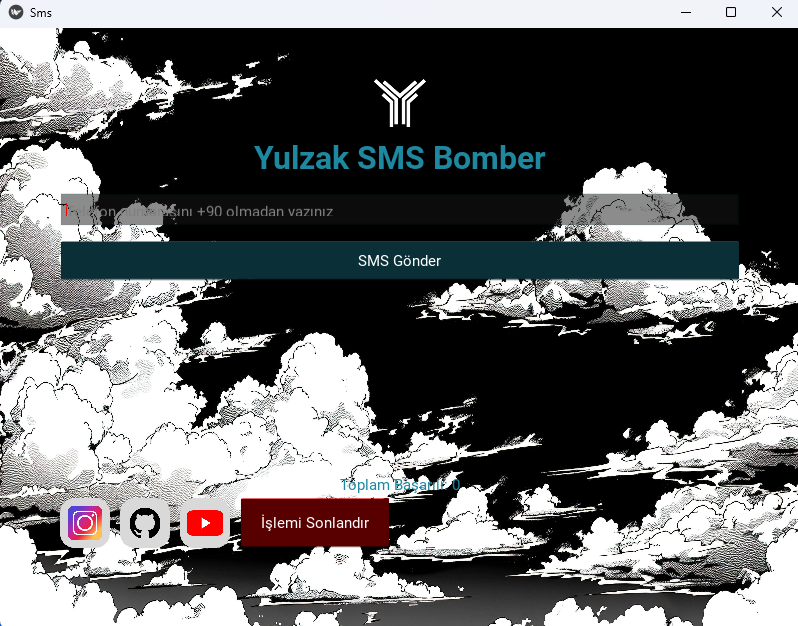

# 🎯 YulzakSmsBomber 🚀


> ⚠ **UYARI:** Bu araç sadece **eğitim ve kişisel kullanım amaçlıdır**. Kullanım sırasında oluşabilecek tüm sorumluluk **ben (Yulzak) dışında tamamen kullanıcıya aittir.**

---

## 🌟 Proje Bilgileri

| Bilgi | Detay |
|-------|-------|
| 🔹 **Proje Sahibi** | Yulzak |
| 🔹 **Platform** | Windows & Mobile |
| 🔹 **Dil** | Node.js / Python |
| 🔹 **Hedef Kitle** | Türk Kullanıcılar |
| 🔹 **Proje Tipi** | SMS Bomber |

---

## ✨ Özellikler 🚀

- 📲 **Hedef Numara SMS Gönderimi**: Otomatik ve hızlı SMS.
- ⚡ **Yüksek Performans**: Kararlı ve hızlı çalışır.
- 🖥 **Windows & Mobile Uyumu**: Platform fark etmeksizin çalışır.
- 🔒 **Gizlilik Odaklı**: Kullanıcı verileri tamamen sizde saklanır.
- 🎨 **Kullanıcı Dostu Arayüz**: Minimal ve kolay anlaşılır.
- ⏱ **Hız Ayarı**: Mesaj gönderim hızını kendi isteğinize göre ayarlayın.
- 📊 **İstatistik Takibi**: Gönderilen SMS sayısı ve durumu anlık takip edilebilir.
- 🧩 **Modüler Yapı**: Kod kolayca özelleştirilebilir ve geliştirmeye açık.

---

## 🛠 Kurulum ve Kullanım

1. Repo’yu klonlayın:  
```bash
git clone https://github.com/Yulzak/YulzakSmsBomber.git
```

2. Gerekli paketleri yükleyin:  
```bash
pip install -r requirements.txt
``` 

3. Scripti çalıştırın:  
```bash
py main.py
```

4. **Hız ayarları ve güvenlik:**  
   - Aşırı hızlı SMS gönderimi hesap kısıtlamalarına yol açabilir.  
   - Lütfen hedef numaraların sahibiyle iletişim izinlerini kontrol edin.

---

## 🎥 Demo Video

[📺 Demo Video İzle](https://youtube.com/watch?v=VIDEO_ID) 

---

## ⚠ Sorumluluk Reddi

- SMS gönderimi sırasında oluşabilecek **hesap kısıtlamaları, spam, veri kayıpları veya diğer zararlar tamamen kullanıcıya aittir.**
- Bu proje **yasalara aykırı kullanım için tasarlanmamıştır.**
- Kullanım sırasında oluşabilecek **spam, taciz veya yasa dışı eylemler** proje sahibinin sorumluluğu dışında kalır.

---

## 📚 Kullanım Notları

- Platform kurallarına uyun ve aşırı hızlı kullanım yapmayın.
- Dosya ve numara güvenliğine dikkat edin.
- SMS gönderim hızını dikkatli ayarlayın; aşırı hız kısıtlamalara yol açabilir.
- Kullanıcı deneyimi için log ve istatistikleri takip edin.

---

## 📬 İletişim

| Platform | Bilgi |
|----------|-------|
| GitHub   | [@Yulzak](https://github.com/Yulzak) |
| YouTube  | [Yulzak](https://youtube.com/@Yulzak) |
| Instagram| [@Yulvez](https://instagram.com/yulvez) |
| E-posta  | yulzak77@gmail.com |

---

## 💡 Ekstra Notlar

- Kod modüler olduğu için **kolayca özelleştirilebilir**.
- Yeni özellikler ve güncellemeler GitHub üzerinde düzenli olarak paylaşılacak.
- Eğitim amaçlı kullanın, başkalarının haklarına saygı gösterin.
- Herhangi bir yasal veya etik sorumluluk tamamen kullanıcıya aittir.

---

## 🔮 Gelecek Güncellemeler

- 🚀 Hız kontrol ve captcha bypass sistemi.  
- 📱 Mobil uyumluluk ve arayüz iyileştirmeleri.  
- 📊 Daha kapsamlı istatistik ve log sistemi.  
- 🎨 Geliştirilmiş görsel ve animasyonlu arayüz.

---
